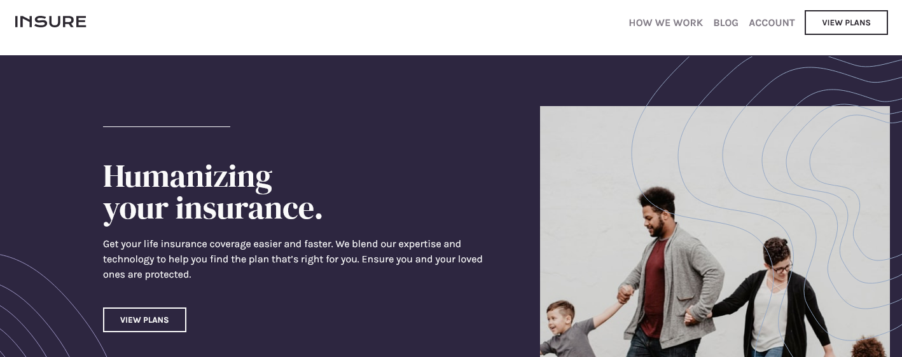

# Frontend Mentor - Insure landing page solution

This is a solution to the [Insure landing page challenge on Frontend Mentor](https://www.frontendmentor.io/challenges/insure-landing-page-uTU68JV8).

## Table of contents

- [Overview](#overview)
  - [The challenge](#the-challenge)
  - [Screenshot](#screenshot)
  - [Links](#links)
- [My process](#my-process)
  - [Built with](#built-with)
  - [What I learned](#what-i-learned)

## Overview

### The challenge

Users should be able to:

- View the optimal layout for the site depending on their device's screen size
- See hover states for all interactive elements on the page

### Screenshot

### Links

- [Solution URL](https://github.com/humbruno/insure-landing)
- [Live Site URL](https://humbruno.github.io/insure-landing/)

## My process

### Built with

- Semantic HTML5 markup
- SCSS
- Flexbox
- Desktop-first workflow
- Fontawesome library

### What I learned

This project has taken my responsive navbar skills to the next level! Even though the final results are definitely not perfect (you can scroll while the navbar is open), I am still very proud of the evolution of both my skills and thought process when creating a collapsing navbar.

The project overall was not too complicated, but it was great practice with absolute positioning images, which in the past I've felt was an area I wasn't great at.
